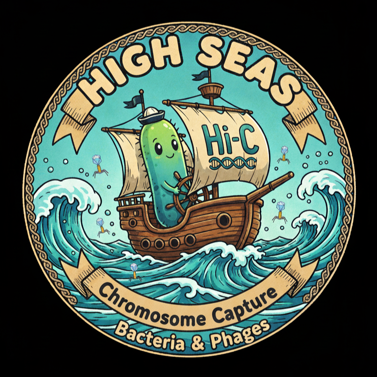
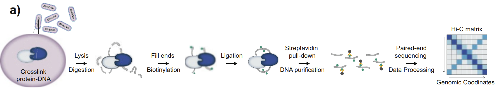

# High Seas

High Seas (a playful twist on "Hi-C's = High-thorughput Chromosomal Capture Techniques") is all about exploring the understudied chromosomal landscapes of important organisms.

It is a project of The Biological Software Section of the Natural Sciences Club at Adam Mickiewicz University.

## Overview - wetlab

This repository will host all source code, documentation, and resources for the "Improving the genomic study of entomopathogenic strains of Bacillus thuringiensis with
chromosome conformation capture techniques for rational biopesticide design" project.



*Figure: Hi‑C protocol overview.*

## Overview - drylab

We base the dry‑lab workflow on the nf-core/hic Nextflow pipeline (nf-core/hic v2.1.0). See the official pipeline documentation: https://nf-co.re/hic/2.1.0/

Summary of how we use and adapt nf-core/hic for bacterial Hi‑C:
- Use nf-core/hic v2.1.0 as the core processing pipeline for mapping, filtering, and building contact maps.
- Apply bacteria-specific presets and parameter changes (smaller genome sizes, enzyme cut-site handling, single‑chromosome/plasmid-aware references).
- Add steps for toxic protein gene interaction detection and phage interaction screening that feed into the main pipeline outputs.
- Adjust binning, normalization, and QC thresholds to reflect prokaryotic Hi‑C data characteristics.
- Retain provenance and citation: Servant et al., nf-core/hic v2.1.0 (see link above) and document any local modifications in the repo (changes/patch files and a short workflow README).

This repository contains the adaptation layer (parameter profiles, helper scripts, and documentation) needed to run and validate nf-core/hic on bacterial datasets.

Servant, N., Ewels, P., Garcia, M. U., Talbot, A., Peltzer, A., & Miller, E. (2023). nf-core/hic: nf-core/hic v2. 1.0. Zenodo.

to make it suitable for bacterial Hi-C

## Features

- Basic Chromosomal Conformation description
- Toxic protein genes interation detection
- Phage detection — looking for interactions with phage-alika DNA

## Getting Started

### Prerequisites


### Installation

1. Clone the repository:
   ```
   git clone https://github.com/mmcharchuta/high-seas.git
   ```
2. Install dependencies:
   ```
   # example
   npm install
   ```

### Usage

Explain how to run the project, with example commands:
```
# example
npm start
```

## Contributing

Contributions welcome! Please open an issue for discussion before sending significant changes. Follow the repo's contribution guidelines (we will add `CONTRIBUTING.md` when ready).

## License

This project is licensed under the MIT License (SPDX: MIT). The full text of the license is provided in the LICENSE file at the repository root.

Copyright (c) 2025 Mikołaj Mieszko Charchuta, Łukasz Kopeć

## Contact

Authors: Mikołaj Mieszko Charchuta, Łukasz Kopeć